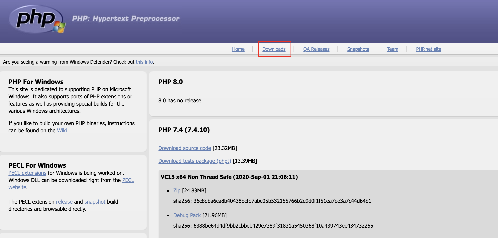

# PHP 7 安装注意事项

获取 PHP 7 主要有三种方式：

* 直接下载源代码并安装
* 安装预编译的二进制文件
* 安装 \*AMP 集合包（比如：XAMPP、WAMP、LAMP、MAMP等等）

## 怎么做

这三种方法按难易程度排列。然而，第一种方法虽然冗长乏味，但是可以让您对扩展和选项进行最有限的控制。

### 直接从源码安装

为了利用这种方法，您需要有一个 C 编译器。如果您运行的是 Windows，**MinGW** 是一个免费的编译器，它已经被证明很受欢迎。它基于 **GNU** 项目提供的 **GNU** 编译器集合（**GCC**）编译器。非免费的编译器包括Borland 公司的经典的 **Turbo C** 编译器，当然，Windows 开发者首选的编译器是 **Visual Studio**。不过，后者主要是为 C++ 开发设计的，所以在编译 PHP 时，需要指定 C 模式。

当在Apple Mac上工作时，最好的解决方案是安装 Apple Developer Tools。你可以使用 Xcode IDE 来编译 PHP 7，或者从终端窗口运行 gcc。在 Linux 环境下，从终端窗口运行 gcc。

当从终端窗口或命令行进行编译时，通常的过程如下：

* `configure`
* `make`
* `make test`
* `make install`

有关配置选项的信息\(即在运行 `configure` 时\) ，请使用 `help`选项:

```bash
configure --help
```

在配置阶段可能遇到的错误如下表所示：

| 错误 | 修复 |
| :--- | :--- |
| `configure: error: xml2-config not found. Please check your libxml2 installation` | 你只需要安装 libxml2。对于这个错误，请参考以下链接：[http://superuser.com/questions/740399/how-to-fix-php-installation-when-xml2-config-is-missing](http://superuser.com/questions/740399/how-to-fix-php-installation-when-xml2-config-is-missing) |
| `configure: error: Please reinstall readline - I cannot find readline.h` | 安装 libreadline-dev |
| configure: WARNING: unrecognized options: --enable-spl, --enable-reflection, --with-libxml | 没什么大不了的。这些选项是默认选项，不需要包括在内。有关详情，请参阅以下连结：[http://jcutrer.com/howto/linux/how-to-compile-php7-on-ubuntu-14-04](http://jcutrer.com/howto/linux/how-to-compile-php7-on-ubuntu-14-04) |

### 从预编译的二进制文件安装 PHP 7

顾名思义，预编译的二进制文件是由别人从 PHP 7 源代码中编译出来的二进制文件。

如果是 Windows 系统，请访问 [http://Windows.php.net/](http://Windows.php.net/)。您将在左侧栏中找到一组友好的提示，这些提示涉及选择哪个版本、线程安全与非线程安全等等。然后，您可以单击“Downloads” ，查找适用于您环境的 ZIP 文件。下载完 ZIP 文件后，将这些文件解压缩到您选择的文件夹中，将 `php.exe` 添加到路径中，并使用 `php.ini` 文件配置 PHP 7。



要在 Mac OS X 系统上安装预编译的二进制文件，最好使用软件包管理系统。对于 PHP 来说，推荐的有以下几种：

* MacPorts
* Liip
* Fink
* Homebrew

对于Linux，使用的打包系统取决于您使用的Linux发行版。 下表按 Linux 发行版组织，总结了在何处查找PHP 7 软件包。

<table>
  <thead>
    <tr>
      <th style="text-align:left">Linux &#x53D1;&#x884C;&#x7248;&#x672C;</th>
      <th style="text-align:left">&#x5728;&#x54EA;&#x91CC;&#x53EF;&#x4EE5;&#x627E;&#x5230; PHP 7</th>
      <th
      style="text-align:left">&#x5907;&#x6CE8;</th>
    </tr>
  </thead>
  <tbody>
    <tr>
      <td style="text-align:left">Debian</td>
      <td style="text-align:left">
        <p><code>packages.debian.org/stable/php</code>
        </p>
        <p><code>repos-source.zend.com/zend-server/early-access/php7/php-7*DEB*</code>
        </p>
      </td>
      <td style="text-align:left">
        <p>&#x4F7F;&#x7528;&#x4EE5;&#x4E0B;&#x547D;&#x4EE4;&#xFF1A;</p>
        <p><code>sudo apt-get install php-7</code>
        </p>
        <p>&#x6216;&#x8005;&#xFF0C;&#x60A8;&#x53EF;&#x4EE5;&#x4F7F;&#x7528;&#x56FE;&#x5F62;&#x5316;&#x7684;&#x8F6F;&#x4EF6;&#x5305;&#x7BA1;&#x7406;&#x5DE5;&#x5177;&#xFF0C;&#x6BD4;&#x5982; <b>Synaptic</b>&#x3002;</p>
        <p>&#x786E;&#x4FDD;&#x9009;&#x62E9; php7(&#x800C;&#x4E0D;&#x662F; php5)&#x3002;</p>
      </td>
    </tr>
    <tr>
      <td style="text-align:left">Ubuntu</td>
      <td style="text-align:left">
        <p><code>packages.ubuntu.com</code>
        </p>
        <p><code>repos-source.zend.com/zend-server/early-access/php7/php-7*DEB*</code>
        </p>
      </td>
      <td style="text-align:left">
        <p>&#x4F7F;&#x7528;&#x4EE5;&#x4E0B;&#x547D;&#x4EE4;&#xFF1A;</p>
        <p><code>sudo apt-get install php7</code>
        </p>
        <p>&#x786E;&#x4FDD;&#x9009;&#x62E9;&#x6B63;&#x786E;&#x7684;Ubuntu&#x7248;&#x672C;&#x3002;</p>
        <p>&#x53E6;&#x5916;&#xFF0C;&#x60A8;&#x53EF;&#x4EE5;&#x4F7F;&#x7528;&#x56FE;&#x5F62;&#x8F6F;&#x4EF6;&#x5305;&#x7BA1;&#x7406;&#x5DE5;&#x5177;&#xFF0C;&#x4F8B;&#x5982;<b>Synaptic</b>&#x3002;</p>
      </td>
    </tr>
    <tr>
      <td style="text-align:left">Fedora / Red Hat</td>
      <td style="text-align:left">
        <p><code>admin.fedoraproject.org/pkgdb/packages</code>
        </p>
        <p><code>repos-source.zend.com/zend-server/early-access/php7/php-7*RHEL*</code>
        </p>
      </td>
      <td style="text-align:left">
        <p>&#x786E;&#x4FDD;&#x60A8;&#x662F; root &#x7528;&#x6237;&#xFF1A;<code>su</code>
        </p>
        <p>&#x4F7F;&#x7528;&#x4EE5;&#x4E0B;&#x547D;&#x4EE4;&#xFF1A;</p>
        <p><code>dnf install php7</code>
        </p>
        <p>&#x53E6;&#x5916;&#xFF0C;&#x60A8;&#x53EF;&#x4EE5;&#x4F7F;&#x7528;&#x56FE;&#x5F62;&#x5316;&#x8F6F;&#x4EF6;&#x5305;&#x7BA1;&#x7406;&#x5DE5;&#x5177;&#xFF0C;&#x4F8B;&#x5982;GNOME&#x8F6F;&#x4EF6;&#x5305;&#x7BA1;&#x7406;&#x5668;&#x3002;</p>
      </td>
    </tr>
    <tr>
      <td style="text-align:left">OpenSUSE</td>
      <td style="text-align:left"><code>software.opensuse.org/package/php7</code>
      </td>
      <td style="text-align:left">
        <p>&#x4F7F;&#x7528;&#x4EE5;&#x4E0B;&#x547D;&#x4EE4;&#xFF1A;
          <br /><code>yast -i php7</code>
        </p>
        <p>&#x6216;&#x8005;&#xFF0C;&#x60A8;&#x53EF;&#x4EE5;&#x8FD0;&#x884C; <b>zypper </b>&#xFF0C;&#x6216;&#x5C06; <b>YaST </b>&#x7528;&#x4F5C;&#x56FE;&#x5F62;&#x5DE5;&#x5177;&#x3002;</p>
      </td>
    </tr>
  </tbody>
</table>

### 通过 \*AMP 集合包安装

**AMP** 指的是 **Apache**、 **MySQL** 和 **PHP** \(也包括 **Perl** 和 **Python**\)。**\***  指的是 Linux、 Windows、 Mac 等\(即 LAMP、 WAMP 和 MAMP\)。这种方法通常是最简单的，但是对初始 PHP 安装的控制较少。另一方面，您可以随时修改 php.ini 文件并安装其他扩展，以根据需要定制安装。下表总结了一些流行的  \*AMP 包:

| 集合包 | 在哪里可以找到 | 是否免费 | 支持\* |
| :--- | :--- | :--- | :--- |
| `XAMPP` | [www.apachefriends.org/download.html](http://www.apachefriends.org/download.html) | Y | WML |
| `AMPPS` | [www.ampps.com/downloads](http://www.ampps.com/downloads) | Y | WML |
| `MAMP` | [www.mamp.info/en](http://www.mamp.info/en) | Y | WM |
| `WampServer` | [sourceforge.net/projects/wampserver](http://sourceforge.net/projects/wampserver) | Y | W |
| `EasyPHP` | [www.easyphp.org](http://www.easyphp.org/) | Y | W |
| `Zend Server` | [www.zend.com/en/products/zend\_server](http://www.zend.com/en/products/zend_server) | N | WML |

在上表中，我们列出了 \*AMP 软件包，其中 **\*** 替换为Windows的**W**，Mac OS X的**M**和Linux的**L**。

## 更多...

当从包中安装预编译的二进制文件时，只安装核心扩展。非核心 PHP 扩展必须单独安装。

值得注意的是，在云计算平台上安装 PHP 7 通常会遵循预编译二进制文件的安装过程。找出您的云环境是否使用 Linux、 Mac 或 Windows 虚拟机，然后按照本文中提到的适当步骤进行操作。

有可能 PHP 7 预编译二进制文件这种安装方式并不是您所喜欢的。但您始终可以从源码中安装，或者考虑安装一个 \*AMP 集合包（见下一节）。对于基于Linux的系统来说，另一种选择是使用个人软件包存档（PPA）的方法。然而，由于PPA没有经过严格的筛选过程，安全性可能是一个问题。关于PPA的安全考虑因素的良好讨论见[http://askubuntu.com/questions/35629/are-ppas-safe-to-add-to-my-system-and-what-are-some-red-flags-to-watch-out-fo](http://askubuntu.com/questions/35629/are-ppas-safe-to-add-to-my-system-and-what-are-some-red-flags-to-watch-out-fo)。

## 参考

一般的安装注意事项，以及三个主要操作系统平台\(Windows，Mac o s x 和 Linux\)的说明，可以在 [http://php.net/manual/en/install.general.php](http://php.net/manual/en/install.general.php) 中找到。

MinGW 的网站是 [http://www.mingw.org/](http://www.mingw.org/)。

关于如何使用 Visual Studio 编译 c 程序的说明可以在 [https://msdn.microsoft.com/en-us/library/bb384838](https://msdn.microsoft.com/en-us/library/bb384838) 中找到。

测试 PHP 7 的另一种可能的方法是使用虚拟机。下面是一些工具和链接，这些工具可能会被证明是有用的：

* **Vagrant：**[https://github.com/rlerdorf/php7dev](https://github.com/rlerdorf/php7dev) \(php7dev是一个Debian 8 Vagrant 镜像，它已被预先配置用于测试PHP应用程序和开发跨多个PHP版本的扩展\)
* **Docker：**[https://hub.docker.com/r/coderstephen/php7/](https://hub.docker.com/r/coderstephen/php7/) \(它包含一个PHP7 Docker容器\)

